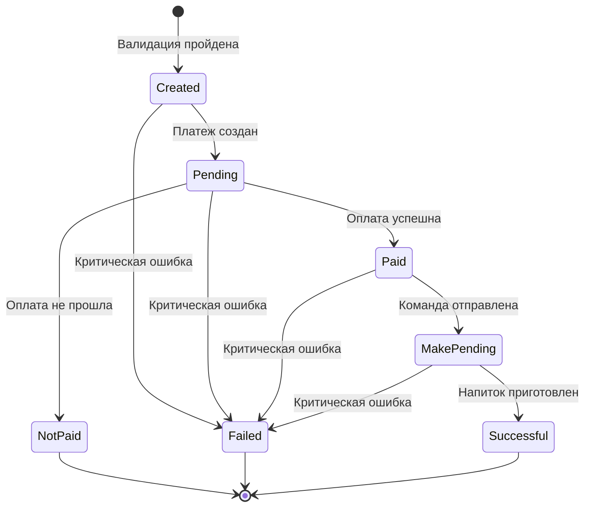

# Design Document

## Overview

Данный документ описывает проектное решение для изменения статусной модели заказа в системе Coffee Payments Server. Текущая модель Order имеет 4 статуса (created, pending, failed, success), которые не покрывают полный жизненный цикл заказа. Новая модель будет включать 6 детализированных статусов и механизм автоматического протухания заказов.

Основные изменения:
- Расширение набора статусов заказа для детального отслеживания жизненного цикла
- Добавление поля expires_at для хранения времени протухания заказа
- Добавление настройки ORDER_EXPIRATION_MINUTES в settings.py
- Добавление метода is_expired() для проверки актуальности заказа
- Обновление логики обработки заказов в views.py для использования новых статусов

## Architecture

### Диаграмма жизненного цикла заказа



### Архитектурные принципы

1. **Минимальные изменения**: Изменения затрагивают только модель Order и логику обработки статусов в views.py
2. **Обратная совместимость**: Миграция БД должна корректно обработать существующие записи
3. **Простота**: Используем встроенные возможности Django без дополнительных библиотек
4. **Логирование**: Все изменения статусов логируются с использованием существующей системы логирования

## Components and Interfaces

### 1. Модель Order (payments/models.py)

#### Изменения в модели

**Новые статусы:**
```python
STATUS_CHOICES = [
    ('created', 'Created'),           # Заказ создан после валидации
    ('pending', 'Pending'),           # Платеж создан, ожидается оплата
    ('paid', 'Paid'),                 # Оплата прошла успешно
    ('not_paid', 'Not Paid'),         # Оплата не прошла
    ('make_pending', 'Make Pending'), # Команда на приготовление отправлена
    ('successful', 'Successful'),     # Заказ успешно завершен
    ('failed', 'Failed'),             # Заказ не может быть завершен
]
```

**Новое поле:**
```python
expires_at = models.DateTimeField()  # Время протухания заказа
```

**Новый метод:**
```python
def is_expired(self):
    """Проверяет, протух ли заказ"""
    from django.utils.timezone import now
    return now() > self.expires_at
```

**Обновленный метод save():**
```python
def save(self, *args, **kwargs):
    if not self.expires_at:
        from django.utils.timezone import now
        from datetime import timedelta
        from django.conf import settings
        
        expiration_minutes = getattr(settings, 'ORDER_EXPIRATION_MINUTES', 15)
        self.expires_at = now() + timedelta(minutes=expiration_minutes)
    
    super().save(*args, **kwargs)
```

### 2. Настройки проекта (coffee_payment/settings.py)

**Новая настройка:**
```python
# Order expiration time in minutes
ORDER_EXPIRATION_MINUTES = 15
```

### 3. Views (payments/views.py)

#### Изменения в функциях обработки

**yookassa_payment_process():**
- При создании Order устанавливать статус 'created'
- После успешного создания платежа обновлять статус на 'pending'

**yookassa_payment_result_webhook():**
- При event_type == 'payment.succeeded' изменять статус с 'pending' на 'paid'
- При event_type == 'payment.canceled' изменять статус с 'pending' на 'not_paid'
- После успешной отправки команды в Tmetr API изменять статус с 'paid' на 'make_pending'
- При ошибках изменять статус на 'failed'

**Проверка протухания:**
- Перед обработкой заказа проверять order.is_expired()
- Если заказ протух, логировать и возвращать ошибку

## Data Models

### Order Model Schema

```python
class Order(models.Model):
    id = models.UUIDField(primary_key=True, default=uuid.uuid4, editable=False)
    external_order_id = models.CharField(max_length=255, null=True, blank=True)
    drink_name = models.CharField(max_length=255)
    device = models.ForeignKey(Device, on_delete=models.CASCADE, related_name="orders")
    merchant = models.ForeignKey(Merchant, on_delete=models.CASCADE, related_name="orders")
    size = models.IntegerField(choices=[(1, 'Small'), (2, 'Medium'), (3, 'Large')])
    price = models.DecimalField(max_digits=10, decimal_places=2)
    status = models.CharField(max_length=50, choices=STATUS_CHOICES)
    expires_at = models.DateTimeField()  # НОВОЕ ПОЛЕ
    created_at = models.DateTimeField(auto_now_add=True)
    updated_at = models.DateTimeField(auto_now=True)
```

### Миграция данных

Существующие заказы со статусами:
- 'created' → остается 'created'
- 'pending' → остается 'pending'
- 'success' → меняется на 'successful'
- 'failed' → остается 'failed'

Для поля expires_at существующих заказов:
- Устанавливается как created_at + ORDER_EXPIRATION_MINUTES

## Error Handling

### Обработка ошибок в жизненном цикле заказа

1. **Ошибка создания платежа:**
   - Статус: created → failed
   - Логирование: "Failed to create payment for order {order_id}: {error}"
   - HTTP ответ: 503 Service Unavailable

2. **Ошибка отправки команды в Tmetr API:**
   - Статус: paid → failed
   - Логирование: "Failed to send make command for order {order_id}: {error}"
   - HTTP ответ: 503 Service Unavailable

3. **Протухший заказ:**
   - Проверка перед обработкой webhook
   - Логирование: "Order {order_id} has expired"
   - HTTP ответ: 400 Bad Request

4. **Некорректный переход статуса:**
   - Логирование: "Invalid status transition for order {order_id}: {old_status} → {new_status}"
   - Статус не изменяется

### Логирование изменений статусов

Все изменения статусов должны логироваться с использованием существующей системы:

```python
from payments.utils.logging import log_info, log_error

log_info(f"Order {order.id} status changed: {old_status} → {new_status}", 'order_status_change')
```

## Testing Strategy

### Unit Tests

Тесты должны находиться в директории `coffee_payment/tests/` и запускаться с таймаутом 30 секунд.

**Тестовые сценарии:**

1. **test_order_creation_with_expiration**
   - Создать заказ
   - Проверить, что expires_at установлен корректно
   - Проверить, что статус = 'created'

2. **test_order_expiration_check**
   - Создать заказ с expires_at в прошлом
   - Проверить, что is_expired() возвращает True
   - Создать заказ с expires_at в будущем
   - Проверить, что is_expired() возвращает False

3. **test_status_transitions**
   - Проверить корректные переходы: created → pending → paid → make_pending → successful
   - Проверить переход в failed из любого статуса

4. **test_custom_expiration_time**
   - Установить ORDER_EXPIRATION_MINUTES = 30
   - Создать заказ
   - Проверить, что expires_at = created_at + 30 минут

5. **test_migration_existing_orders**
   - Создать заказ со старым статусом 'success'
   - Применить миграцию
   - Проверить, что статус изменился на 'successful'

### Integration Tests

1. **test_payment_flow_with_status_changes**
   - Симулировать полный цикл: создание заказа → создание платежа → webhook → отправка команды
   - Проверить корректность изменения статусов на каждом этапе

2. **test_expired_order_handling**
   - Создать заказ с коротким временем протухания
   - Дождаться протухания
   - Попытаться обработать webhook
   - Проверить, что возвращается ошибка

### Запуск тестов

```bash
# Активировать conda окружение
conda activate base

# Запустить тесты с таймаутом
python manage.py test coffee_payment.tests --timeout=30
```

## Implementation Notes

### Порядок внедрения

1. Добавить настройку ORDER_EXPIRATION_MINUTES в settings.py
2. Обновить модель Order с новыми статусами и полем expires_at
3. Создать миграцию БД
4. Обновить логику в views.py для использования новых статусов
5. Добавить проверки протухания заказов
6. Обновить логирование для новых статусов
7. Написать и запустить тесты

### Совместимость с текущим кодом

- Существующие статусы 'created', 'pending', 'failed' сохраняются
- Статус 'success' заменяется на 'successful' через миграцию
- Все существующие функции продолжат работать после обновления

### Производительность

- Добавление поля expires_at не влияет на производительность
- Метод is_expired() выполняет простое сравнение дат
- Индексы на поле status уже существуют

### Безопасность

- Время протухания задается в настройках, недоступных для внешних пользователей
- Проверка протухания предотвращает обработку устаревших заказов
- Логирование всех изменений статусов для аудита
